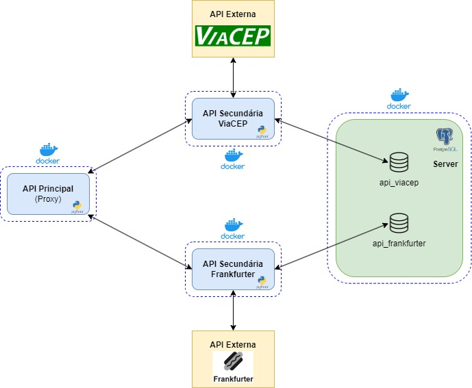

# Sistema de Câmbio com APIs em Flask/Python

Este projeto consiste em um sistema de câmbio implementado através de múltiplas APIs REST com Flask/Python. A arquitetura é composta por uma API principal atuando como proxy e duas APIs secundárias que implementam as regras de negócio.

## Instruções de Instalação

### Pré-requisitos
- Docker e Docker Compose
- Git

### Passos para instalação

1. Clone os repositórios:
```bash
mkdir sistema-cambio
cd sistema-cambio

# Clone os repositórios 
git clone https://github.com/FernandoMiyazaki/api-principal-corretora.git
git clone https://github.com/FernandoMiyazaki/api-secundaria-viacep.git
git clone https://github.com/FernandoMiyazaki/api-secundaria-frankfurter.git
```

2. Certifique-se de que os seguintes arquivos estão presentes:

- `api-principal-corretora/.env`
- `api-secundaria-viacep/.env`
- `api-secundaria-frankfurter/.env`

3. Dê permissão ao script de inicialização do banco de dados:
```bash
cd api-principal-corretora
icacls init-db.sh /grant Everyone:F  # Windows
# OU
chmod +x init-db.sh  # Linux/Mac
```

4. Inicie os serviços:
```bash
docker-compose up -d
```

5. Verifique se todos os serviços estão rodando:
```bash
docker-compose ps
```

## Arquitetura do Sistema

A arquitetura do sistema é baseada em microserviços, onde cada componente tem uma responsabilidade bem definida:



### Componentes:

1. **API Principal (Proxy)**:
   - Atua como ponto de entrada para os clientes
   - Encaminha requisições para as APIs secundárias
   - Não implementa regras de negócio
   - Não possui banco de dados próprio

2. **API ViaCEP**:
   - Gerencia usuários e endereços
   - Implementa validações de dados (CPF, email, CEP)
   - Consulta a API externa ViaCEP
   - Mantém seu próprio banco de dados

3. **API Frankfurter**:
   - Gerencia transações financeiras e cotações
   - Implementa validações financeiras
   - Consulta a API externa Frankfurter
   - Mantém seu próprio banco de dados

4. **PostgreSQL**:
   - Servidor de banco de dados único
   - Contém bancos separados para cada API secundária

5. **pgAdmin**:
   - Interface web para administração dos bancos de dados

## APIs Externas Utilizadas

### ViaCEP

ViaCEP é um webservice gratuito para consulta de Códigos de Endereçamento Postal (CEP) do Brasil.

- **Licença**: Gratuito para uso comercial e não-comercial
- **Cadastro**: Não necessário
- **Exemplo de uso**: `viacep.com.br/ws/01001000/json/`
- **Formato de entrada**: CEP com 8 dígitos
- **Formatos de saída**: JSON, XML, JSONP

#### Endpoints utilizados:
- Consulta por CEP: `viacep.com.br/ws/{cep}/json/`

#### Exemplo de resposta:
```json
{
  "cep": "01001-000",
  "logradouro": "Praça da Sé",
  "complemento": "lado ímpar",
  "bairro": "Sé",
  "localidade": "São Paulo",
  "uf": "SP",
  "ibge": "3550308",
  "gia": "1004",
  "ddd": "11",
  "siafi": "7107"
}
```

### Frankfurter

Frankfurter é uma API gratuita e de código aberto para dados de taxas de câmbio que acompanha as taxas de referência publicadas por fontes institucionais e não comerciais, como o Banco Central Europeu.

- **Licença**: Gratuito para uso comercial e não-comercial, código aberto
- **Cadastro**: Não necessário
- **Sem limite de requisições**
- **Exemplo de uso**: `api.frankfurter.dev/v1/latest?base=USD`

#### Endpoints utilizados:
- Cotação atual: `api.frankfurter.dev/v1/latest?base=USD&symbols=BRL`

#### Exemplo de resposta:
```json
{
  "amount": 1.0,
  "base": "USD",
  "date": "2025-04-03",
  "rates": {
    "BRL": 5.6241
  }
}
```

## Endpoints da API Principal

### Usuários
- `GET /users` - Lista todos os usuários
- `POST /users` - Cria um novo usuário
- `GET /users/{id}` - Obtém um usuário específico
- `PUT /users/{id}` - Atualiza um usuário
- `DELETE /users/{id}` - Remove um usuário
- `GET /users/{id}/saldo` - Obtém o saldo de um usuário

### Transações
- `POST /transactions/compra` - Registra uma compra de dólares
- `POST /transactions/venda` - Registra uma venda de dólares
- `GET /transactions/{id}` - Obtém uma transação específica

## Verificando os Serviços

Após alguns segundos, todos os serviços devem estar em execução:

- API Principal: http://localhost:5000/swagger
- API ViaCEP: http://localhost:5001/swagger
- API Frankfurter: http://localhost:5002/swagger
- pgAdmin: http://localhost:8080

Para acessar o pgAdmin:

1. Acesse http://localhost:8080
2. Faça login com:
   - Email: admin@example.com
   - Senha: admin
3. Adicione um novo servidor:
   - Nome: LocalDB
   - Host: db
   - Porta: 5432
   - Usuário: postgres
   - Senha: postgres

## Parando os Serviços

```bash
cd api-principal-corretora
docker-compose down
```

Para remover volumes e imagens:

```bash
docker-compose down -v --rmi all
```